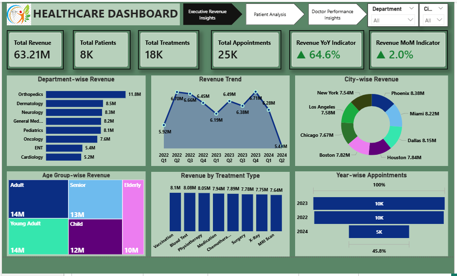

# Hospital Management Analytics Dashboard (Power BI)

A complete healthcare analytics project that transforms raw hospital data into actionable insights using Power BI.

This project presents an end-to-end healthcare analytics solution focused on hospital operations, revenue performance, patient behavior, and doctor efficiency. The dashboard is designed to help hospital management make data-driven decisions.

## Project Objective
- Analyze overall hospital performance
- Identify top-performing departments, doctors, and cities
- Understand patient behavior and visit patterns
- Evaluate revenue trends and growth
- Provide strategic insights and business recommendations

## Key Features

### Report 1: Executive Revenue Insights
- Total Revenue: **63.21M**
- Revenue YoY Growth: **64.6%**
- Revenue MoM Growth: **2.0%**
- Department-wise and city-wise revenue analysis

### Report 2: Patient Analysis
- Total Patients: **8K**
- Average Visits per Patient: **3.13**
- Returning Patients: **81.7%**
- Gender, age group, and insurance distribution

### Report 3: Doctor Performance Insights
- Top 10 doctors by revenue
- Revenue per doctor
- Specialty-wise revenue analysis
- Appointment trends and department performance

## Key Insights
- Orthopedics is the highest revenue-generating department
- Phoenix is the top revenue-contributing city
- High patient retention (**81.7%**) indicates strong service engagement
- A small group of doctors contributes significantly to total revenue
- Adult and senior age groups contribute most to hospital revenue

## Business Recommendations
- Focus on high-performing departments for revenue growth
- Improve performance in lower-performing specialties
- Enhance patient retention strategies
- Optimize doctor scheduling based on demand patterns
- Expand services in high-revenue cities

## Dataset Overview
The dataset consists of five interconnected tables:
1. Patients
2. Doctors
3. Appointments
4. Treatments
5. Billing

## Tools & Technologies
- Power BI
- DAX (Data Analysis Expressions)
- Power Query
- Data Modeling (Star Schema)

## Key KPIs
- Total Revenue
- Total Patients
- Total Treatments
- Total Appointments
- Average Visits per Patient
- Returning Patients %
- Revenue Growth (MoM & YoY)
- Revenue per Doctor

## Dashboard Pages
1. Executive Revenue Insights
2. Patient Analysis
3. Doctor Performance Insights

## Project Highlights
- Multi-page interactive dashboard
- Advanced KPI calculations using DAX
- Data cleaning and transformation using Power Query
- Business-focused insights and storytelling
- Professional report documentation

## Dashboard Images

### Executive Revenue Insights

### Patient Analysis

### Doctor Performance Insights

## Project Files
- Power BI (`.pbix`) file
- Dataset (Excel)
- Analysis Report (PDF/Word)
- Dashboard images (`.png`)

## Author
**Saranya D**  
Aspiring Data Analyst

## Tags
`Power BI` `Healthcare Analytics` `Hospital Dashboard` `DAX` `Power Query` `Data Modeling` `Business Intelligence` `Dashboard Design` `Data Visualization` `Healthcare Data`
